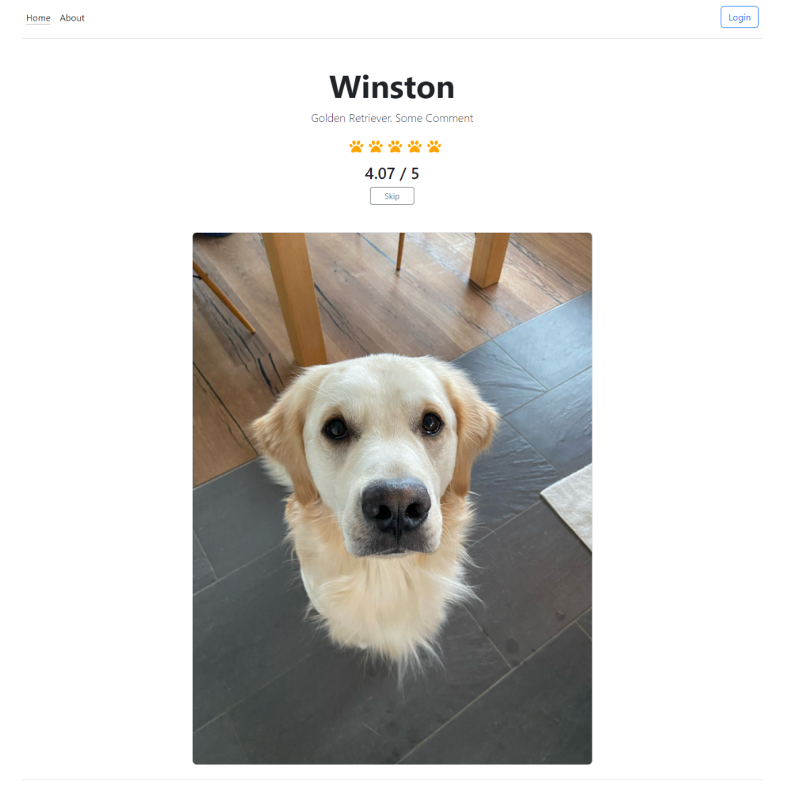
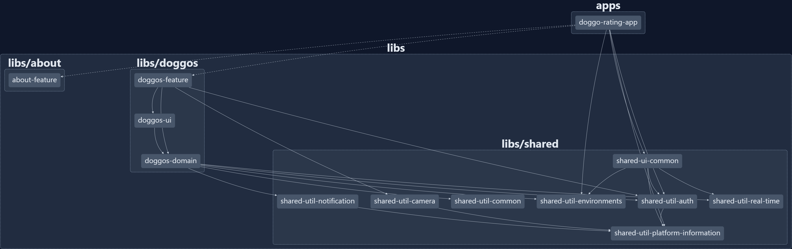

# Doggo Rate App

A demo application for uploading pictures of your dog and rate the Bois from zero to five paws 🐾

## Features

- ✅ Cross Platform with Capacitor
- ✅ Signals
- ✅ Real Time Communication w/ SignalR (WebSockets)
- ✅ Control Flow Syntax
- ✅ Angular 17
- ✅ Standalone Components
- ✅ Nx Workspace v17 with architecture constraints
- ✅ State Management with NgRx
- ✅ Functional APIs
- ✅ Authentication

## Authors

- [@FabianGosebrink](https://twitter.com/FabianGosebrink)

## Screenshots

