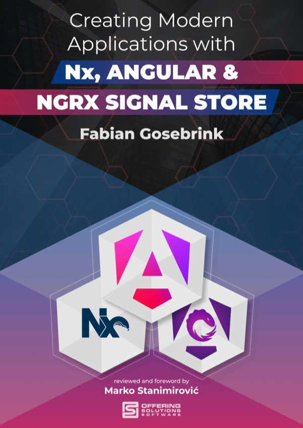
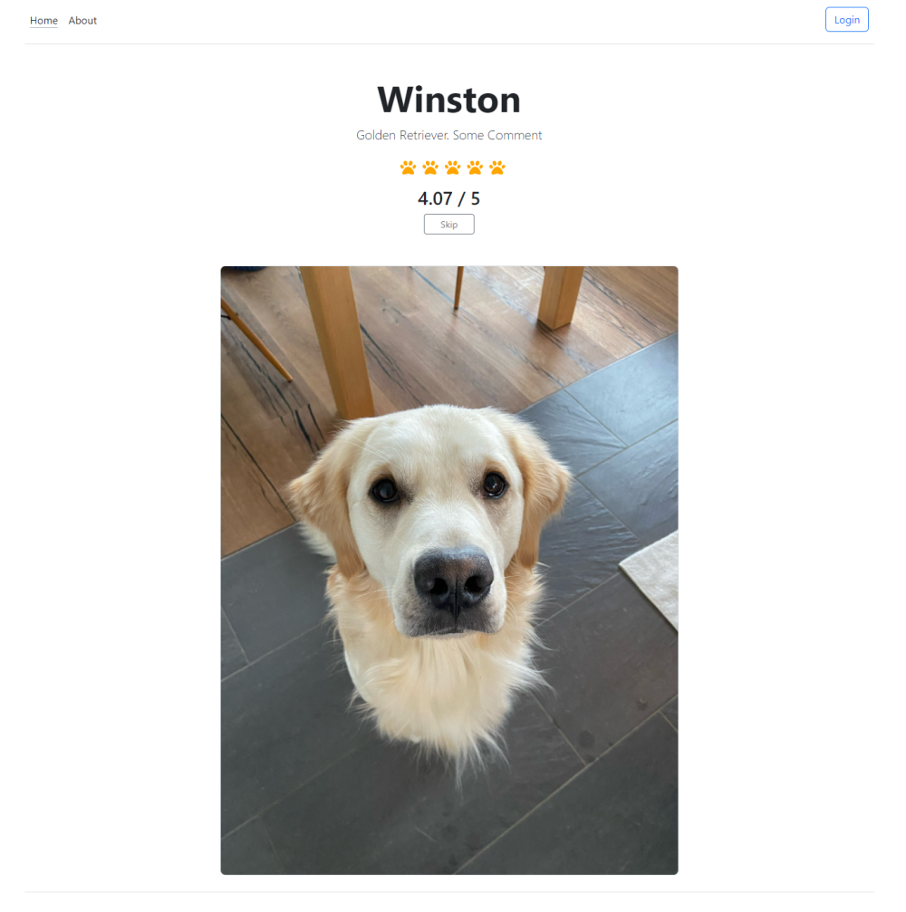
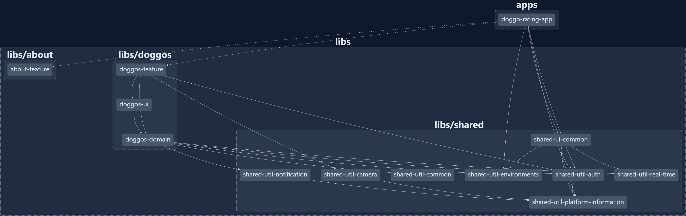

# Dog Rate App

A demo application for uploading pictures of your dog and rate the Bois from zero to five paws 🐾

[](https://github.com/FabianGosebrink/dog-rate-app/actions/workflows/angular.yml)


## 📖 The Book

<a href="https://offering.solutions/ebook-modern-angular-apps-ngrx/"></a>

This application is the foundation of the book **Creating Modern Applications with Nx, Angular & NgRx Signal Store** — everything the book teaches about architecture, Nx workspaces, the NgRx Signal Store, code quality and testing is built and explained on this very codebase.

You can [**download the book for free**](https://offering.solutions/ebook-modern-angular-apps-ngrx/).

Want your own Angular application reviewed along the same principles? We offer [**Angular frontend audits**](https://offering.solutions/angular-frontend-audit/).

<br clear="right">
<br>



## Features

- ✅ Signals
- ✅ Real Time Communication w/ SignalR (WebSockets)
- ✅ Control Flow Syntax
- ✅ Standalone Components
- ✅ Nx Workspace (latest) with architecture constraints
- ✅ State Management with NgRx Signal Store :)
- ✅ Functional APIs
- ✅ Authentication with Auth0
- ✅ Cross Platform with Capacitor
- ✅ Zoneless

## Getting Started

### Prerequisites

- [Node.js](https://nodejs.org/) 20+
- [.NET 10 SDK](https://dotnet.microsoft.com/download) — only needed if you want to run the backend locally

### Run the app

```sh
npm install
npm start
```

The Angular app is served at `http://localhost:4200`. Out of the box it talks to the hosted backend on Azure, so you don't need to run anything else to click around.

### Run the backend locally (optional)

```sh
npm run run:be        # http launch profile
npm run run:be:https  # https launch profile
```

To make the frontend use your local API instead of the hosted one, switch the `server` URL in [`libs/shared/util-environments/src/lib/environment.ts`](libs/shared/util-environments/src/lib/environment.ts) to the commented-out `localhost` entry.

Or start frontend and backend together:

```sh
npm run start:all
```

## Testing

```sh
npm test              # all projects with coverage, merges the combined report, refreshes the badges
npm run test:watch    # watch mode
npm run lint          # lint all projects
```

Tests run on [Vitest](https://vitest.dev/) in a fully zoneless setup. `npm test` writes per-project coverage to `coverage/libs/**` and merges everything into `coverage/combined/index.html` — the badges above come from that combined report.

## Building

```sh
npm run build          # web build (dist/)
npm run build-desktop  # desktop app via Electron
npm run build-mobile   # iOS/Android via Capacitor
```

## Architecture

An Nx monorepo with enforced module boundaries: `apps/` contains the Angular host (`dog-rate-app`), the Playwright e2e project and the .NET API (`dotnet-dog-api`); `libs/` is sliced per scope into `feature` (routed containers), `ui` (presentational components), `domain` (stores + API services) and `util-*` (auth, camera, notifications, real-time, platform detection).



## Authors

- [Fabian Gosebrink](https://www.linkedin.com/in/fabian-gosebrink/)
